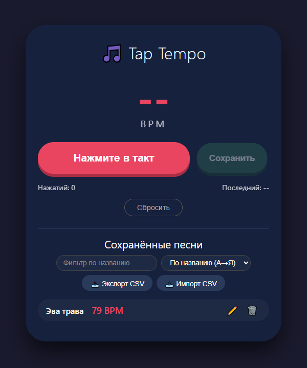

# 🎵 Tap Tempo – PWA для вычисления и сохранения BPM

**Tap Tempo** – это прогрессивное веб-приложение (PWA), которое позволяет музыкантам, диджеям и всем, кто работает с ритмом, быстро определить темп (BPM) любой песни простым нажатием на кнопку в такт. Все данные хранятся локально в браузере, приложение работает офлайн и может быть установлено на рабочий стол как нативное.



---

## 📦 Функциональность

### Основной режим – Tap Tempo
- Нажимайте на большую кнопку **«Нажмите в такт»** в ритм музыки.
- Алгоритм вычисляет средний интервал между нажатиями и отображает текущий BPM.
- Автоматический сброс через 3 секунды бездействия.
- Отображение количества нажатий и BPM последнего интервала.

### Управление записями
- **Сохранить** – после вычисления BPM кнопка активируется. При нажатии открывается модальное окно для ввода названия песни.
- **Список записей** – все сохранённые песни отображаются с названием и BPM.
- **Фильтрация** – по части названия (регистронезависимая).
- **Сортировка** – по названию (А→Я / Я→А), по BPM (возрастание / убывание), по дате добавления (сначала новые / старые).
- **Редактирование** – изменение названия сохранённой песни (карандаш).
- **Удаление** – удаление записи с подтверждением (корзина).

### Импорт / Экспорт
- **Экспорт в CSV** – выгружает все записи в файл `tap_tempo_YYYY-MM-DD.csv` с заголовком `BPM,Название`.
- **Импорт из CSV** – загружает файл CSV и добавляет новые записи. Дубли (совпадение названия и BPM) не создаются.

### PWA-возможности
- Установка на рабочий стол (Android, iOS, Windows, macOS) через браузер.
- Полная офлайн-поддержка благодаря Service Worker.
- Адаптивный дизайн под мобильные и десктопные экраны.

---

## 🚀 Демо и установка

### Локальный запуск
1. Склонируйте или скачайте репозиторий.
2. Убедитесь, что у вас есть все файлы (см. структуру ниже).
3. Запустите любой локальный веб-сервер, например:
    - **VS Code Live Server** – клик правой кнопкой по `index.html` → Open with Live Server.
    - **Python** – `python -m http.server 8000` и перейдите на `http://localhost:8000`.
    - **Node.js** – `npx serve .`
4. Откройте приложение в браузере.

### Установка как PWA
- В **Chrome / Edge** нажмите на иконку установки в адресной строке (или в меню «Установить приложение»).
- В **Safari на iOS** нажмите «Поделиться» → «На экран «Домой»».
- После установки приложение запускается в полноэкранном режиме без адресной строки.

---

## 📁 Структура файлов

```
tap-tempo-pwa/
├── index.html          # Главная страница
├── style.css           # Стили (тёмная тема, адаптив)
├── app.js              # Вся логика (tap tempo, управление записями, импорт/экспорт)
├── manifest.json       # PWA-манифест
├── sw.js               # Service Worker (кэширование)
├── icons/              # Папка с иконками (должна быть создана)
│   ├── icon-192.png    # Иконка 192x192
│   └── icon-512.png    # Иконка 512x512
└── README.md           # Этот файл
```

**Примечание:** Иконки необходимо создать самостоятельно (например, через [PWA Builder](https://www.pwabuilder.com/imageGenerator) или любой графический редактор). В манифесте указаны пути к ним.

---

## 🛠️ Технологии

- **HTML5 / CSS3** – разметка и стилизация.
- **Vanilla JavaScript** – весь код написан на чистом JS без внешних зависимостей.
- **localStorage** – хранение записей в браузере.
- **Service Worker** – кэширование ресурсов для офлайн-режима.
- **Web App Manifest** – настройка PWA (иконки, тема, ориентация).

---

## 💡 Возможные улучшения

- Звуковой или тактильный отклик при нажатии.
- Анимация пульсации текущего BPM.
- Поддержка импорта/экспорта в JSON.
- Добавление тегов или жанров к записям.
- Синхронизация с облаком (Firebase, Google Drive и т.п.).
- Многопользовательский режим (общие плейлисты).

---

## 📝 Формат CSV

При экспорте создаётся файл с разделителем `,` и заголовком:

```csv
BPM,Название
128,"Song Name"
95,"Another Song"
```

При импорте ожидается аналогичный формат. Допускаются кавычки вокруг названия. BOM-символ добавляется для корректного открытия в Excel.

---

## 🤝 Лицензия

Этот проект распространяется под лицензией MIT. Вы можете свободно использовать, модифицировать и распространять его.

---

## 📧 Контакты

Если у вас есть вопросы или предложения, создавайте issue в репозитории или свяжитесь с автором.

---

**Наслаждайтесь музыкой и точным темпом!** 🎶